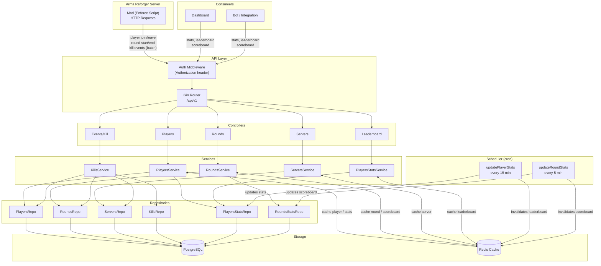

# frontline-stats

Stats backend for Arma Reforger servers. Receives game events from a mod (kills, rounds, players), aggregates metrics, and exposes a REST API for dashboards, bots, and integrations.

> Sequel to [frontline-api](https://github.com/ffx64/frontline-api). | [Leia em Português](./README.pt-br.md)

---

## How it works

A mod written in Enforce Script running on the game server sends events to the API in real time. The backend indexes everything in PostgreSQL, keeps a Redis cache, and updates aggregated stats periodically via cron jobs.



---

## Stack

Go 1.24 · Gin · GORM v2 · PostgreSQL · Redis · robfig/cron v3

---

## Running locally

**Requirements:** Go 1.24+, PostgreSQL, Redis.

```bash
git clone https://github.com/ffx64/frontline-stats
cd frontline-stats

cp .env.example .env  # fill in your values
go mod download
APP_ENV=dev go run ./cmd/main.go
```

In `test` mode the database is SQLite in-memory, no PostgreSQL needed.

**Build:**
```bash
go build -o frontline-stats ./cmd/main.go
```

---

## Environment Variables

```env
APP_ENV=prod              # dev | prod | test  (default: test)
GIN_PORT=8080

API_KEY=                  # if set, requires Authorization header on all routes

POSTGRESQL_HOST=
POSTGRESQL_PORT=
POSTGRESQL_USERNAME=
POSTGRESQL_PASSWORD=
POSTGRESQL_DB=gamestats
POSTGRESQL_SSLMODE=disable

REDIS_HOST=localhost
REDIS_PORT=6379
REDIS_PASSWORD=
```

---

## API

Base path: `/api/v1`. Authentication via `Authorization: <API_KEY>` header.

<details>
<summary><strong>Players</strong></summary>

| Method | Route | Description |
|--------|-------|-------------|
| `POST` | `/players` | Create a player |
| `GET` | `/players/:guid` | Get by GUID |
| `PUT` | `/players/:guid` | Update player data |
| `GET` | `/players/:guid/stats` | Get player stats |
| `GET` | `/players/if-not-exists-create/:username/:guid/:serverLastID` | Create if not exists |

</details>

<details>
<summary><strong>Rounds</strong></summary>

| Method | Route | Description |
|--------|-------|-------------|
| `POST` | `/rounds` | Start a round |
| `GET` | `/rounds/:id` | Get by ID |
| `PUT` | `/rounds/:id/ended` | End a round |
| `GET` | `/rounds/:id/scoreboard` | Round scoreboard |
| `GET` | `/rounds/server/:serverId/player/:playerId` | Paginated round history |

</details>

<details>
<summary><strong>Servers</strong></summary>

| Method | Route | Description |
|--------|-------|-------------|
| `POST` | `/servers` | Register a server |
| `GET` | `/servers` | List all servers |
| `GET` | `/servers/:id` | Get by ID |
| `PUT` | `/servers/:id` | Update server |
| `DELETE` | `/servers/:id` | Delete server |

</details>

<details>
<summary><strong>Events & Leaderboard</strong></summary>

| Method | Route | Description |
|--------|-------|-------------|
| `POST` | `/events/kill` | Ingest kill events batch from mod |
| `GET` | `/leaderboard` | Top 20 by kills |
| `GET` | `/leaderboard/headshots` | Top 20 by headshots |
| `GET` | `/leaderboard/vehicles` | Top 20 by vehicle kills |

</details>

---

## Cache

Read endpoints are cached in Redis. If Redis is unavailable, requests fall through to the database silently.

| Key | TTL | Invalidated by |
|-----|-----|----------------|
| `player:{guid}` | 30 min | `PUT /players/:guid` |
| `player:stats:{guid}` | 14 min | `PUT /players/:guid` |
| `leaderboard:*` | 5 min | cron every 15 min |
| `round:{id}` | 5 min | `PUT /rounds/:id/ended` |
| `round:scoreboard:{id}` | 5 min | cron every 5 min |
| `server:{id}` | 60 min | `PUT /servers/:id` |

---

## Background Jobs

Two jobs run in the background using `pg_try_advisory_xact_lock`, ensuring only one instance processes at a time even in multi-replica deployments.

- **Every 15 min:** recalculates `players_stats` - kills, deaths, KDR, headshots, vehicle kills, most used weapons and hit zones
- **Every 5 min:** recalculates `rounds_stats` for all rounds with status `in_progress`
