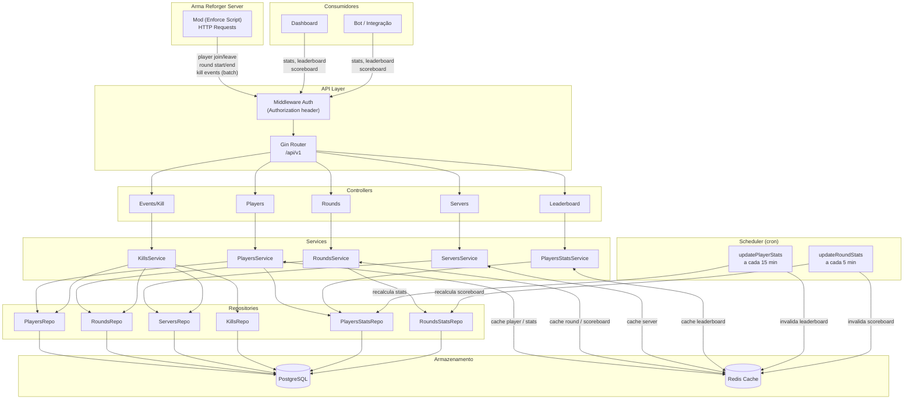

# frontline-stats

Backend em Go projetado para ingestão, indexação e consulta de estatísticas de partidas em servidores Arma Reforger-like. Ele coleta eventos (principalmente kills), gera métricas por jogador, rounds, servidores, e oferece endpoints REST otimizados para dashboards, bots e integrações.

---

## Arquitetura



---

## Stack

| Componente | Tecnologia |
|---|---|
| Linguagem | Go 1.24 |
| HTTP Framework | Gin |
| ORM | GORM v2 |
| Banco de dados | PostgreSQL |
| Cache | Redis |
| Agendamento | robfig/cron v3 |
| UUID | google/uuid |

---

## Estrutura do Projeto

```
├── cmd/
│   ├── main.go               # entrypoint — inicializa DB, Redis, serviços e servidor
│   └── gin/
│       └── server.go         # configura rotas, middlewares e CORS
├── internal/
│   ├── cache/                # helpers genéricos Redis (Get/Set/Delete/DeletePattern)
│   ├── controllers/          # handlers HTTP — recebem request, chamam service, retornam JSON
│   ├── database/             # conexão com PostgreSQL e Redis
│   ├── dtos/                 # structs de entrada e saída da API
│   ├── entities/             # modelos GORM mapeados para o banco
│   ├── errors/               # erros customizados com HTTP status embutido
│   ├── helpers/              # advisory locks, conversores DTO
│   ├── middleware/           # autenticação por header
│   ├── repositories/         # acesso ao banco de dados (queries, UPSERTs)
│   ├── scheduler/            # jobs periódicos de agregação de stats
│   └── services/             # regras de negócio
```

---

## Endpoints

> Base path: `/api/v1`
> Autenticação: header `Authorization: <API_KEY>` (opcional se `API_KEY` não estiver configurado)

### Players

| Método | Rota | Descrição |
|--------|------|-----------|
| `POST` | `/players` | Cria um jogador |
| `GET` | `/players/:guid` | Busca jogador por GUID |
| `PUT` | `/players/:guid` | Atualiza dados do jogador |
| `GET` | `/players/:guid/stats` | Estatísticas agregadas do jogador |
| `GET` | `/players/if-not-exists-create/:username/:guid/:serverLastID` | Cria jogador se ainda não existe |

### Rounds

| Método | Rota | Descrição |
|--------|------|-----------|
| `POST` | `/rounds` | Inicia um novo round |
| `GET` | `/rounds/:id` | Busca round por ID |
| `PUT` | `/rounds/:id/ended` | Finaliza um round |
| `GET` | `/rounds/:id/scoreboard` | Placar do round (rounds_stats) |
| `GET` | `/rounds/server/:serverId/player/:playerId` | Rounds paginados por servidor e jogador |

### Eventos

| Método | Rota | Descrição |
|--------|------|-----------|
| `POST` | `/events/kill` | Ingere batch de kill events |

### Servidores

| Método | Rota | Descrição |
|--------|------|-----------|
| `POST` | `/servers` | Registra um servidor |
| `GET` | `/servers` | Lista todos os servidores |
| `GET` | `/servers/:id` | Busca servidor por ID |
| `PUT` | `/servers/:id` | Atualiza servidor |
| `DELETE` | `/servers/:id` | Remove servidor |

### Leaderboard

| Método | Rota | Descrição |
|--------|------|-----------|
| `GET` | `/leaderboard` | Top 20 por kills |
| `GET` | `/leaderboard/headshots` | Top 20 por headshots |
| `GET` | `/leaderboard/vehicles` | Top 20 por vehicle kills |

---

## Cache Redis

Leituras frequentes são servidas do cache com TTL por tipo de dado. Em caso de falha do Redis, o sistema cai transparentemente para o banco.

| Chave | TTL | Invalidado por |
|-------|-----|----------------|
| `player:{guid}` | 30 min | `PUT /players/:guid` |
| `player:stats:{guid}` | 14 min | `PUT /players/:guid` |
| `leaderboard:kills` | 5 min | scheduler (cada 15 min) |
| `leaderboard:headshots` | 5 min | scheduler (cada 15 min) |
| `leaderboard:vehicles` | 5 min | scheduler (cada 15 min) |
| `round:{id}` | 5 min | `PUT /rounds/:id/ended` |
| `round:scoreboard:{id}` | 5 min | scheduler (cada 5 min) |
| `server:{id}` | 60 min | `PUT /servers/:id` |

---

## Agendamento

Dois jobs periódicos mantêm as estatísticas agregadas atualizadas, usando `pg_try_advisory_xact_lock` para garantir execução única mesmo com múltiplas instâncias.

| Job | Intervalo | O que faz |
|-----|-----------|-----------|
| `updatePlayerStats` | 15 minutos | Recalcula kills, deaths, headshots, KDR, hit zones e armas mais usadas em `players_stats` |
| `updateRoundStats` | 5 minutos | Recalcula scoreboard de rounds em progresso em `rounds_stats` |

---

## Variáveis de Ambiente

```env
# Aplicação
APP_ENV=prod          # dev | prod | test (padrão: test)
GIN_PORT=8080         # porta do servidor HTTP (padrão: 8080)
API_KEY=              # chave de autenticação (opcional)

# PostgreSQL
POSTGRESQL_HOST=
POSTGRESQL_PORT=
POSTGRESQL_USERNAME=
POSTGRESQL_PASSWORD=
POSTGRESQL_DB=gamestats
POSTGRESQL_SSLMODE=disable

# Redis
REDIS_HOST=localhost  # padrão: localhost
REDIS_PORT=6379       # padrão: 6379
REDIS_PASSWORD=       # opcional
```

---

## Como Rodar

```bash
# Instalar dependências
go mod download

# Desenvolvimento (SQLite in-memory, sem PostgreSQL necessário)
APP_ENV=dev go run ./cmd/main.go

# Produção
APP_ENV=prod go run ./cmd/main.go

# Build
go build -o gamestats ./cmd/main.go
```
