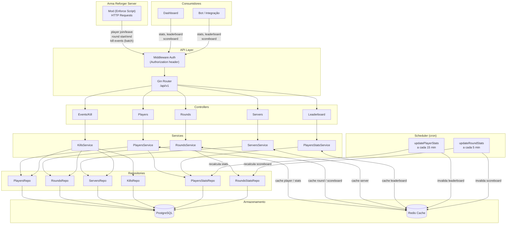

# frontline-stats

Backend de estatísticas para servidores Arma Reforger. Recebe eventos do jogo via mod (kills, rounds, jogadores), agrega métricas e expõe uma API REST para dashboards, bots e integrações.

> Continuação do [frontline-api](https://github.com/ffx64/frontline-api). | [Read in English](./README.md)

---

## Como funciona

Um mod em Enforce Script rodando no servidor de jogo envia eventos em tempo real para a API. O backend indexa tudo no PostgreSQL, mantém um cache no Redis e atualiza as estatísticas agregadas periodicamente via jobs cron.



---

## Stack

Go 1.24 · Gin · GORM v2 · PostgreSQL · Redis · robfig/cron v3

---

## Rodar localmente

**Pre-requisitos:** Go 1.24+, PostgreSQL, Redis.

```bash
git clone https://github.com/ffx64/frontline-stats
cd frontline-stats

cp .env.example .env  # ajuste as variaveis
go mod download
APP_ENV=dev go run ./cmd/main.go
```

Para rodar em modo `test`, o banco e SQLite in-memory, sem precisar de PostgreSQL.

**Build:**
```bash
go build -o frontline-stats ./cmd/main.go
```

---

## Variaveis de Ambiente

```env
APP_ENV=prod              # dev | prod | test  (padrao: test)
GIN_PORT=8080

API_KEY=                  # se definido, exige header Authorization em todas as rotas

POSTGRESQL_HOST=
POSTGRESQL_PORT=
POSTGRESQL_USERNAME=
POSTGRESQL_PASSWORD=
POSTGRESQL_DB=gamestats
POSTGRESQL_SSLMODE=disable

REDIS_HOST=localhost
REDIS_PORT=6379
REDIS_PASSWORD=
```

---

## API

Base path: `/api/v1`. Autenticacao via header `Authorization: <API_KEY>`.

<details>
<summary><strong>Players</strong></summary>

| Metodo | Rota | Descricao |
|--------|------|-----------|
| `POST` | `/players` | Cria um jogador |
| `GET` | `/players/:guid` | Busca por GUID |
| `PUT` | `/players/:guid` | Atualiza dados |
| `GET` | `/players/:guid/stats` | Estatisticas do jogador |
| `GET` | `/players/if-not-exists-create/:username/:guid/:serverLastID` | Cria se nao existir |

</details>

<details>
<summary><strong>Rounds</strong></summary>

| Metodo | Rota | Descricao |
|--------|------|-----------|
| `POST` | `/rounds` | Inicia um round |
| `GET` | `/rounds/:id` | Busca por ID |
| `PUT` | `/rounds/:id/ended` | Finaliza o round |
| `GET` | `/rounds/:id/scoreboard` | Placar do round |
| `GET` | `/rounds/server/:serverId/player/:playerId` | Historico paginado |

</details>

<details>
<summary><strong>Servidores</strong></summary>

| Metodo | Rota | Descricao |
|--------|------|-----------|
| `POST` | `/servers` | Registra um servidor |
| `GET` | `/servers` | Lista servidores |
| `GET` | `/servers/:id` | Busca por ID |
| `PUT` | `/servers/:id` | Atualiza |
| `DELETE` | `/servers/:id` | Remove |

</details>

<details>
<summary><strong>Eventos & Leaderboard</strong></summary>

| Metodo | Rota | Descricao |
|--------|------|-----------|
| `POST` | `/events/kill` | Recebe batch de kills do mod |
| `GET` | `/leaderboard` | Top 20 por kills |
| `GET` | `/leaderboard/headshots` | Top 20 por headshots |
| `GET` | `/leaderboard/vehicles` | Top 20 por vehicle kills |

</details>

---

## Cache

Endpoints de leitura sao cacheados no Redis. Se o Redis estiver fora, o sistema cai silenciosamente para o banco.

| Chave | TTL | Quando invalida |
|-------|-----|-----------------|
| `player:{guid}` | 30 min | `PUT /players/:guid` |
| `player:stats:{guid}` | 14 min | `PUT /players/:guid` |
| `leaderboard:*` | 5 min | cron a cada 15 min |
| `round:{id}` | 5 min | `PUT /rounds/:id/ended` |
| `round:scoreboard:{id}` | 5 min | cron a cada 5 min |
| `server:{id}` | 60 min | `PUT /servers/:id` |

---

## Jobs periodicos

Dois jobs rodam em background com `pg_try_advisory_xact_lock`, garantindo que so uma instancia processa por vez mesmo em deploy multi-replica.

- **A cada 15 min:** recalcula `players_stats` - kills, deaths, KDR, headshots, vehicle kills, armas e hit zones mais usadas
- **A cada 5 min:** recalcula `rounds_stats` para todos os rounds com status `in_progress`
